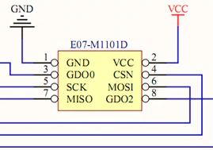

# Arduino/CC1101

## Description

This folder contains the [CC1101 MSP430 Energia Library v2](https://github.com/abhra0897/msp430_cc1101_energia_v2) open source library by abhra0897 for the MSP430 family and CC1101. The header file for the CC1101 is similar to the ones Arduino uses but this library is **only** compatible with Energia IDE. For the purpose of the project, we will be using the MSP430FR2355 to interface with the CC1101. The example Tx/Rx code is supposed to read the current time in ms and transmit the data to the receiver **(Not yet tested)**. To run the program, place the CC1101_MSP430 folder into the Energia library folder. Then place the Tx/Rx folders into the Energia sketch folder. Please refer to the two pinouts at the bottom.

## Documentation
* [MSP430FR2433 User Guide](https://www.ti.com/lit/pdf/slau680)

## 8-pin CC1101 Pinout

## MSP430FR2355 Pinout

    VDD  -> VCC
    SI   -> P1.2
    SO   -> P1.3
    CSn  -> P3.3
    SCK  -> P1.1
    GDO2 -> P3.2
    GDO0 -> P3.1
    GND  -> GND
